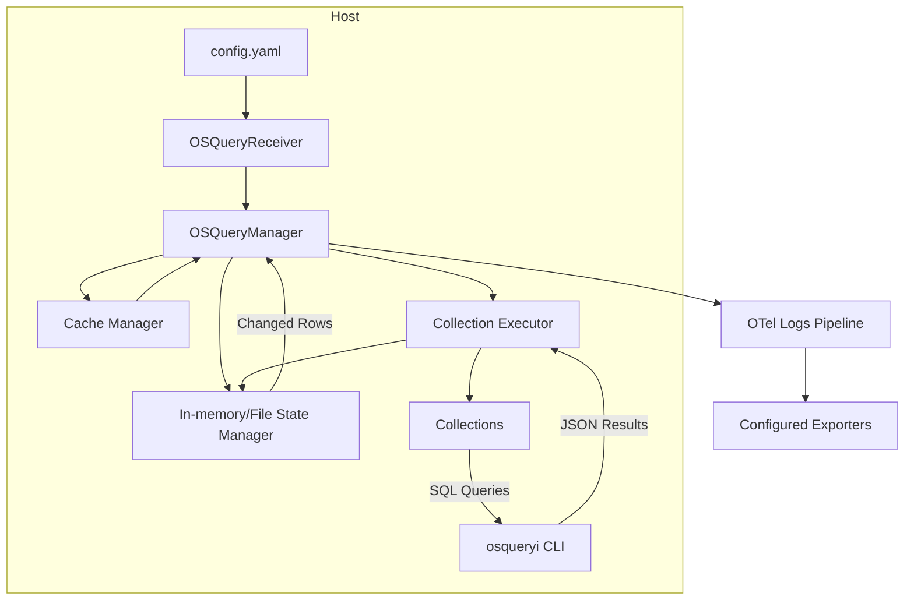
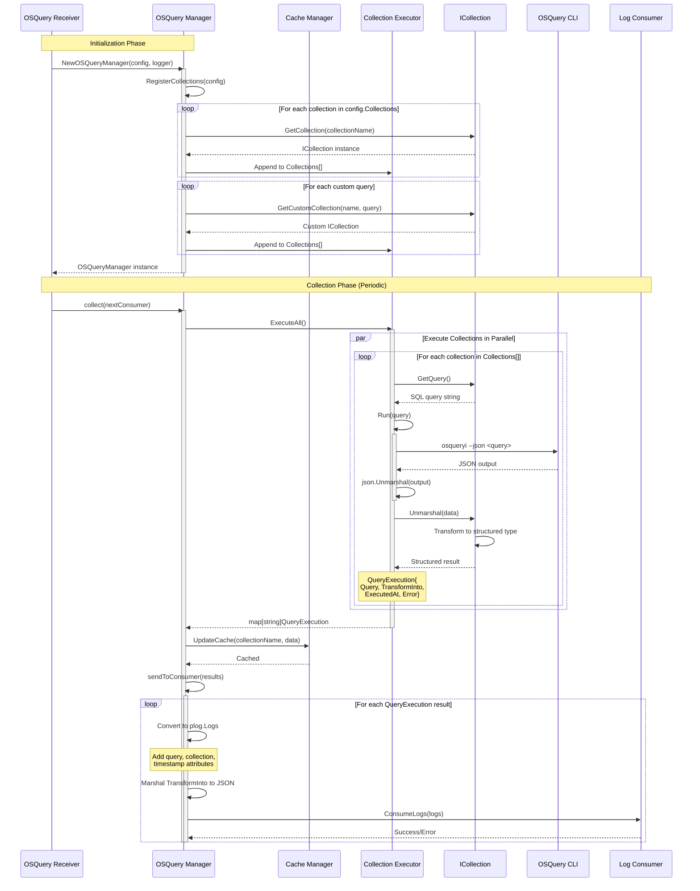
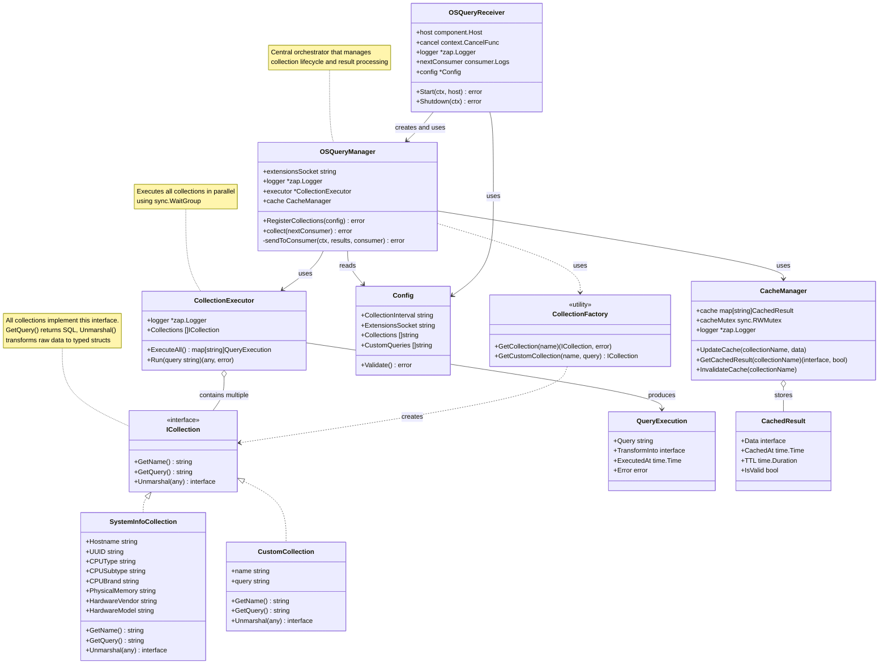

# OS Query Receiver

An OTel receiver for [osquery](https://osquery.readthedocs.io/en/stable/).

## Sample Config

Put below yaml block in your OTel receiver config. You can run queries according to your usecase.

```yaml
osqueryreceiver:
  tmp_dir: /tmp/osqueryreceiver/tmp_data/
  extensions_socket: /var/osquery/osquery.em
  interval: 60s
  collections:
    - system_info
    - package_info
    # - processes
    # - users
  custom_queries:
    # - select * from processes limit 5;
    # - select * from os_version;
    # - select * from logged_in_users;
    # - select * from listening_ports limit 5;
    # - select * from packages limit 5;
```

## Diagrams

### Overview



### Sequence Diagram



### Class Diagram



## TODO

* What format do we send the data in? Right now the idea is to use logs. But we need to define it.
* What would be the communication medium for Inventory manager with the backend service? How would it instruct the collector to resend entire inventory in case of data corruption/loss?
